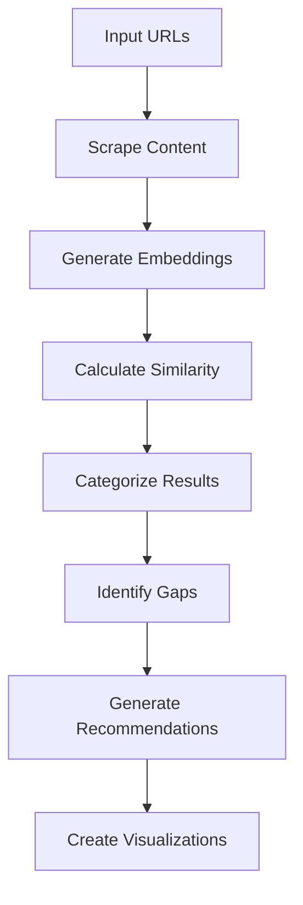

# AI Content Coverage Analysis Tool

A lightweight, performant AI content coverage analysis tool that replicates aicoverage.locomotive.agency functionality with minimal infrastructure overhead and maximum development velocity.

## 🌟 Features

### Core Analysis (MVP)
- **URL input form** with validation and loading states
- **Content extraction** via web scraping API (Firecrawl)
- **AI analysis** using OpenAI embeddings and similarity scoring
- **Results visualization** with interactive radar charts
- **Export functionality** (CSV, JSON, TXT)

### Enhanced Features
- **Batch URL processing** for competitor comparison
- **Historical analysis** tracking and trends
- **Custom query generation** and expansion
- **Advanced visualizations** and insights
- **Dark mode support**

## 🏗️ Architecture

### Core Stack
- **Frontend**: Next.js 14 (App Router) with TypeScript and Tailwind CSS
- **Backend**: Next.js API Routes (serverless functions)
- **Data**: In-memory processing with optional Redis caching
- **Deployment**: Single Vercel deployment for both frontend and backend

### Key Technologies
- **Next.js 14**: App Router, TypeScript, serverless functions
- **AI/ML**: OpenAI embeddings (text-embedding-3-small), GPT-3.5-turbo
- **UI**: Tailwind CSS, Radix UI components, Recharts for visualizations
- **State**: Zustand for client-side state management
- **Scraping**: Firecrawl API with fallback mechanisms
- **Caching**: Optional Upstash Redis for performance optimization

## 🚀 Quick Start

### Prerequisites
- Node.js 18.0.0 or higher
- OpenAI API key
- Firecrawl API key (optional but recommended)

### Installation

1. **Clone the repository**
   ```bash
   git clone <repository-url>
   cd ai-coverage-tool
   ```

2. **Install dependencies**
   ```bash
   npm install
   ```

3. **Set up environment variables**
   ```bash
   cp .env.example .env.local
   ```
   
   Edit `.env.local` with your API keys:
   ```env
   # Required
   OPENAI_API_KEY=sk-your-openai-api-key-here
   FIRECRAWL_API_KEY=fc-your-firecrawl-api-key-here
   
   # Optional (for caching)
   UPSTASH_REDIS_URL=redis://your-redis-url
   UPSTASH_REDIS_TOKEN=your-redis-token
   ```

4. **Run the development server**
   ```bash
   npm run dev
   ```

5. **Open your browser**
   Navigate to [http://localhost:3000](http://localhost:3000)

## 📊 How It Works

### 1. Content Extraction
- Primary: Firecrawl API for robust content extraction
- Fallback: Simple fetch with HTML parsing
- Caching: Redis or in-memory caching for performance

### 2. AI Analysis Process


### 3. Similarity Scoring
- Uses OpenAI's `text-embedding-3-small` model
- Calculates cosine similarity between content embeddings
- Categorizes queries into topic areas (Technical, Marketing, SEO, etc.)
- Identifies content gaps and competitive opportunities

## 🎯 Usage

### Basic Analysis
1. Enter your target URL
2. Optionally add competitor URLs (up to 5)
3. Add custom search queries (optional)
4. Click "Start Analysis"
5. Review results and export data

### Understanding Results

#### Overall Score
- 0-100 scale based on semantic similarity to analyzed queries
- Higher scores indicate better content coverage

#### Radar Chart
- Visual comparison across content categories
- Blue line: Your content performance
- Gray dashed line: Competitor average

#### Coverage Gaps
- **High Priority**: Significant opportunities (20+ point gaps)
- **Medium Priority**: Moderate opportunities (10-20 point gaps)
- **Low Priority**: Minor improvements (<10 point gaps)

#### Recommendations
- AI-generated suggestions for content improvement
- Specific topic areas to focus on
- Competitor examples for reference

## 🔧 API Reference

### POST /api/analyze
Perform comprehensive content analysis.

**Request Body:**
```typescript
{
  targetUrl: string;
  competitorUrls?: string[];
  queries?: string[];
  options?: {
    includeTopResults?: boolean;
    resultCount?: number;
    generateQueries?: boolean;
  };
}
```

**Response:**
```typescript
{
  success: boolean;
  data: {
    analysisId: string;
    targetScore: number;
    competitorResults: CompetitorResult[];
    radarData: RadarChartData[];
    coverageGaps: CoverageGap[];
    recommendations: string[];
    // ... more fields
  };
}
```

### POST /api/scrape
Extract content from a single URL.

### POST /api/export
Export analysis results in various formats.

## 🚀 Deployment

### Vercel (Recommended)

1. **Push to GitHub**
   ```bash
   git push origin main
   ```

2. **Deploy to Vercel**
   ```bash
   npx vercel --prod
   ```

3. **Configure environment variables** in Vercel dashboard

### Environment Variables for Production
```env
OPENAI_API_KEY=sk-your-production-key
FIRECRAWL_API_KEY=fc-your-production-key
UPSTASH_REDIS_URL=redis://your-redis-url
UPSTASH_REDIS_TOKEN=your-redis-token
```

## 💰 Cost Optimization

### Estimated Monthly Costs (1000 analyses)
- **Vercel Pro**: $20/month (if exceeding free tier)
- **Firecrawl**: $20/month (20k pages)
- **OpenAI API**: ~$10/month (embeddings + GPT-3.5)
- **Upstash Redis**: Free tier available
- **Total**: ~$50/month for production-ready solution

### Cost-Saving Tips
1. Use caching extensively (Redis recommended)
2. Implement rate limiting
3. Use `text-embedding-3-small` instead of large model
4. Cache embeddings for frequently analyzed content
5. Batch API requests when possible

## 🔒 Security Features

- **Input validation** with Zod schemas
- **Rate limiting** (10 requests/minute per IP)
- **URL validation** to prevent malicious inputs
- **Error handling** with proper error boundaries
- **CORS configuration** for API endpoints

## 🛠️ Development

### Scripts
```bash
npm run dev          # Start development server
npm run build        # Build for production
npm run start        # Start production server
npm run lint         # Run ESLint
npm run type-check   # Run TypeScript checks
```

### Project Structure
```
ai-coverage-tool/
├── app/
│   ├── api/
│   │   ├── analyze/route.ts    # Main analysis endpoint
│   │   ├── scrape/route.ts     # Content scraping
│   │   └── export/route.ts     # Data export
│   ├── components/
│   │   ├── ui/                 # Reusable UI components
│   │   ├── AnalysisForm.tsx    # Main input form
│   │   ├── ResultsDisplay.tsx  # Results viewer
│   │   ├── RadarChart.tsx      # Visualization component
│   │   └── ...
│   ├── lib/
│   │   ├── types.ts           # TypeScript definitions
│   │   ├── analyzer.ts        # AI analysis logic
│   │   ├── scraper.ts         # Web scraping utilities
│   │   ├── cache.ts           # Caching layer
│   │   └── store.ts           # State management
│   ├── globals.css            # Global styles
│   ├── layout.tsx             # Root layout
│   └── page.tsx               # Main page
├── public/                    # Static assets
├── package.json
├── tailwind.config.js
├── next.config.js
└── README.md
```

## 🧪 Testing

### Manual Testing Checklist
- [ ] URL validation works correctly
- [ ] Analysis completes successfully
- [ ] Results display properly
- [ ] Export functionality works
- [ ] Error handling is graceful
- [ ] Loading states are responsive

### Recommended Test URLs
```
Target: https://example.com/blog/content-marketing
Competitors:
- https://competitor1.com/content-strategy
- https://competitor2.com/marketing-guide
```

## 🤝 Contributing

1. Fork the repository
2. Create a feature branch (`git checkout -b feature/amazing-feature`)
3. Commit your changes (`git commit -m 'Add amazing feature'`)
4. Push to the branch (`git push origin feature/amazing-feature`)
5. Open a Pull Request

## 📄 License

This project is licensed under the MIT License - see the [LICENSE](LICENSE) file for details.

## 🆘 Support

### Common Issues

**Q: Analysis fails with "Rate limit exceeded"**
A: Wait a minute and try again. Consider implementing user authentication for higher limits.

**Q: Content extraction returns empty results**
A: Check if the URL is accessible and contains substantial text content. Some sites block automated scraping.

**Q: OpenAI API errors**
A: Verify your API key is correct and has sufficient credits.

### Getting Help
- 📧 Email: support@ai-coverage-tool.com
- 🐛 Issues: [GitHub Issues](https://github.com/your-repo/ai-coverage-tool/issues)
- 📖 Documentation: [Full Docs](https://ai-coverage-tool.vercel.app/docs)

## 🙏 Acknowledgments

- [OpenAI](https://openai.com) for embeddings and language models
- [Firecrawl](https://firecrawl.dev) for reliable web scraping
- [Vercel](https://vercel.com) for seamless deployment
- [Tailwind CSS](https://tailwindcss.com) for utility-first styling
- [Recharts](https://recharts.org) for beautiful visualizations

---

Built with ❤️ using Next.js, OpenAI, and modern web technologies. 